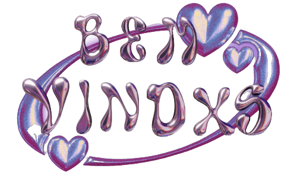

<a name="readme-top"></a>


<!-- PROJECT LOGO -->
<br />
<div align="center">
  <a href="https://github.com/othneildrew/Best-README-Template">
    
  </a>

  <h3 align="center">Meu site pessoal</h3>

  
</div>


<details>
  <summary>Indíce</summary>
  <ol>
    <li>
      <a href="#about-the-project">Sobre o projeto</a>
      <ul>
        <li><a href="#built-with">Feito com</a></li>
      </ul>
    </li>
    <li>
      <a href="#getting-started">Iniciando Projeto</a>
      <ul>
        <li><a href="#prerequisites">Pré requisitos</a></li>
        <li><a href="#installation">Instalação</a></li>
      </ul>
    </li>
    <li><a href="#contact">Contato</a></li>
    <li><a href="#acknowledgments">Agradecimentos</a></li>
  </ol>
</details>


<!-- ABOUT THE PROJECT -->
## Sobre o projeto

[![Meu site pessoal][product-screenshot]](https://projeto-react-reprograma-rose.vercel.app/)

O projeto é um site pessoal que fala um pouco sobre mim numa apresentação breve, com roteamento de Home, Sobre, Portifólio e Contato. Na aba portifólio apresentam meus projetos do Github, e na aba Contato á uma integração por Firebase para receber as mensagem de contatação. Adicionei um menu de Dropdown com links para meu LinkedIn e Github.

<p align="right">(<a href="#readme-top">Voltar ao topo</a>)</p>

### Feito com

* [![React][React.js]][React-url]

<p align="right">(<a href="#readme-top">Voltar ao topo</a>)</p>

<!-- GETTING STARTED -->
## Iniciando projeto

### Pré requisitos
* npm
  ```sh
  npm install npm@latest -g
  ```

### Instalação


1. Clone o repositório
   ```sh
   git clone https://github.com/naizacoelho/Projeto-react-reprograma.git
   ```
2. Instale os pacotes pelo NPM
   ```sh
   npm install
   ```


<p align="right">(<a href="#readme-top">Voltar ao topo</a>)</p>

<!-- CONTACT -->
## Contato

Naíza - [LinkedIn](https://www.linkedin.com/in/naiza-coelho-5808a4211/) - naiza.coelho2@gmail.com

Link do projeto: [https://github.com/naizacoelho/Projeto-react-reprograma](https://github.com/naizacoelho/Projeto-react-reprograma)

<p align="right">(<a href="#readme-top">Voltar ao topo</a>)</p>

<!-- ACKNOWLEDGMENTS -->
## Agradecimentos


* [Firebase](https://firebase.google.com/docs/database?hl=pt-br)
* [Phosphor icons](https://phosphoricons.com/)
* [Vercel](https://vercel.com/)
* [Axios](https://axios-http.com/ptbr/docs/intro)
* [HTML CSS COLORS](https://www.htmlcsscolor.com/)


<p align="right">(<a href="#readme-top">Voltar ao topo</a>)</p>


<!-- MARKDOWN LINKS & IMAGES -->
[product-screenshot]: src/assets/meu-site.png
[React.js]: https://img.shields.io/badge/React-20232A?style=for-the-badge&logo=react&logoColor=61DAFB
[React-url]: https://reactjs.org/